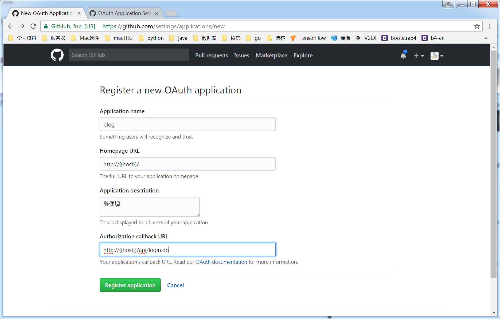

# github配置
### 1. 申请密钥
#### 首先需要有一个github的账号，然后点击后面的地址申请开发者密钥 [申请地址](https://github.com/settings/developers)


### 2. 点击 _New OAuth App_
#### 按照步骤申请即可，如果不会google


### 3. 配置



### 4. 修改程序配置
#### 前往src ==> main ==> resources ==> application.yml下找到

```yml
github:
# github授权信息
  clientId: 你的授权信息
  clientSecret: 你的授权密匙
```